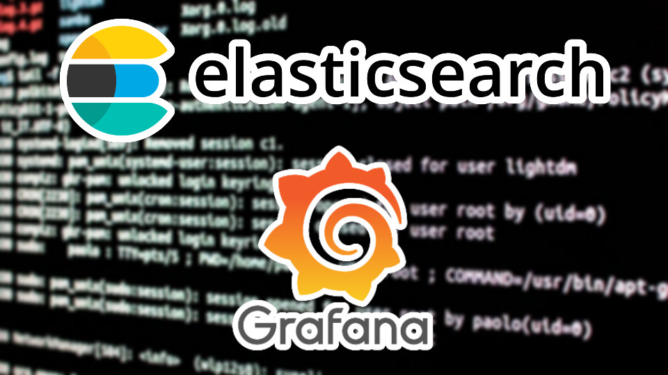

# Monitorización y respuesta ante incidentes con Grafana, Elasticsearch y Fail2ban
En este proyecto se explica paso a paso la implementación de un sistema de monitorización e IR en un entorno virtualizado con VirtualBox.
Este sistema está compuesto por herramientas open source, siendo estas Grafana, Elasticsearch y Fail2ban.

### Tabla de contenidos
- [Introducción y MVs](docs/introduccion-y-mvs.md)
- [Instalación de Elasticsearch en la MV Monitor](docs/instalacion-de-elasticsearch-en-la-mv-monitor.md)
- [Configuración de Elasticsearch](docs/configuracion-de-elasticsearch.md)
- [Instalación de Grafana en la MV Monitor](docs/instalacion-de-grafana-en-la-mv-monitor.md)
- [Instalación de Metricbeat en la MV víctima](docs/instalacion-de-metricbeat-en-la-mv-victima.md)
- [Instalación de Filebeat en la MV víctima](docs/instalacion-de-filebeat-en-la-mv-victima.md)
- [Conectando Grafana con Elasticsearch](docs/conectando-grafana-con-elasticsearch.md)
  - [Data Source de Filebeat para recopilar logs](docs/data-source-de-filebeat-para-recopilar-logs.md)
  - [Data Source de Metricbeat para recopilar métricas del sistema operativo](docs/data-source-de-metricbeat-para-recopilar-metricas-del-sistema-operativo.md)
- [Creación de dashboards en Grafana](docs/creacion-de-dashboards-en-grafana.md)
  - [Dashboard de seguridad (Filebeat)](docs/dashboard-de-seguridad-(filebeat).md)
  - [Dashboard de métricas de rendimiento (Metricbeat)](docs/dashboard-de-metricas-de-rendimiento-(metricbeat).md)
- [Protegiendo el servidor SSH de la MV víctima con Fail2ban](docs/protegiendo-el-servidor-ssh-de-la-mv-victima-con-fail2ban.md)
  - [Dashboard de Fail2ban en Grafana](docs/dashboard-de-fail2ban-en-grafana.md)
- [Conclusiones y webgrafía](docs/conclusiones-webgrafia.md)

